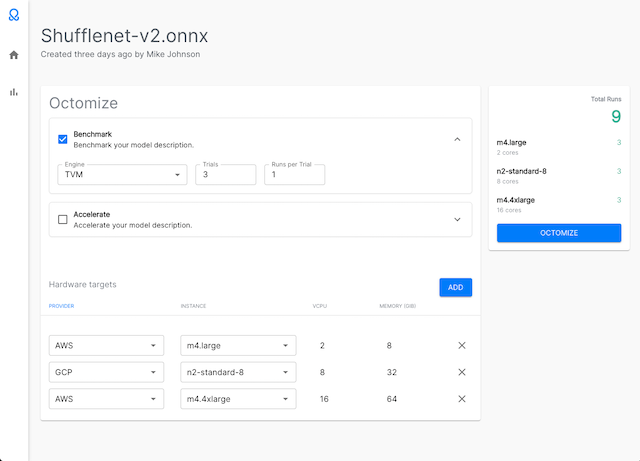

# Octomize Demo


## Getting Started
Install dependencies
```sh
yarn
```

Execute tests
```sh
yarn test
```

Run
```sh
yarn serve
# You can now view the app at http://localhost:1234
```

## Notes
* Using beta verion of `yup` for validation to make typescript usage less painful
* Did not spend any time on responsive design
* In there interest of time, I did not implement any error handling.
* Used quite a few inline component styles where further encapsulation or global themes may have been more appropriate.
* View models are derived from the domain model.  Toggling of benchmark and accelerate config doesn;t lend itself well to optional values, so I'm using component state to manage it.  This means domain validation is unaware of form state, and so a custom form validator is also used.
* Code coverage is almost non-existent.  I've created a one test suite as an example, but figured time was better spend completing the demo.

## Known issues
* Invalid autocomplete option where the default is not valid, but I didn't want to prepend a blank value.  This generates a few console warnings, and an error about uncontrolled form state.
* Side nav is not anchored when screen scrolls.
